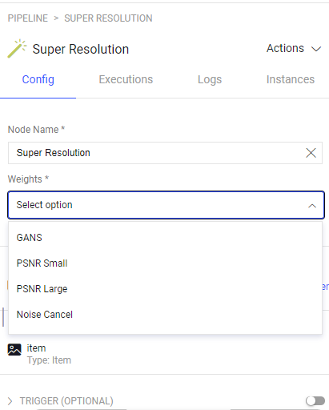

# Super Resolution Node

The **Super Resolution** node is an image processing tool that uses Residual Dense and Adversarial Networks to perform Super Resolution on images.  \
The code is based on the following [GitHub repository](https://github.com/idealo/image-super-resolution)

## Quick Start:

1. Go to `Pipelines` and `Create new pipeline`.
2. Build a custom work flow that requires supper resolution on an item os an image
3. Define the weights (model) in the supper resolution node configuration panel. \
These are the supported weights: 
   * RDN: psnr-large, psnr-small, noise-cancel
   * RRDN: gans
4. Start pipeline

## Node inputs and Outputs:

The Data Split node has one input and multiple outputs, each output represents a group.

## How it works:

When an item passes through the node, will run the chosen model and will generate new item. \
The new item will be uploaded to the same dataset as the original item. to the following location: \
`super_resolution/<model_name>/<original_item.dir>/<original_item.name>`

## Node Configuration:

**Configuration**

- **Node Name:** Display name on the canvas.
- **weights:** Set weights: 
   * RDN: psnr-large, psnr-small, noise-cancel
   * RRDN: gans

## Contributions, Bugs and Issues - How to Contribute

We welcome anyone to help us improve this app.  
[Here's](CONTRIBUTING.md) a detailed instructions to help you open a bug or ask for a feature request.